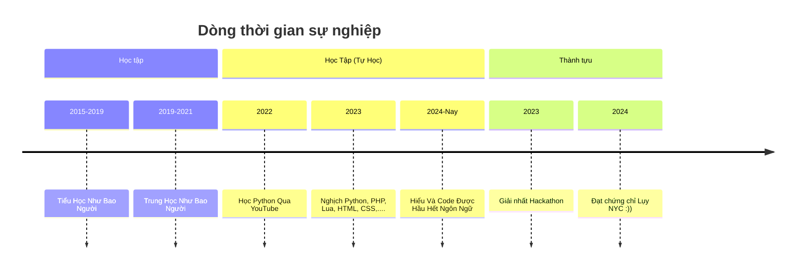

<p align="center">
  
</p>

## 🌸 Giới thiệu

```diff
+ 💻 Lập trình viên Full-stack với 5+ năm kinh nghiệm
! 🎨 Đam mê thiết kế giao diện anime-style
# 🏆 Chứng chỉ Microsoft Certified Developer
@@ Mong muốn tạo ra những sản phẩm "kawaii" nhưng mạnh mẽ @@
```

## 🎀 Hành trình phát triển



## 🛠 Kỹ năng chuyên môn

<div align="center">
  
  ### 📊 Biểu đồ kỹ năng
  
  
</div>

## 🌸 Ngôn ngữ lập trình yêu thích

<div align="center">
  
  **Frontend**  
   
  
  
  
  **Backend**  
  
  
  
  **Database**  
  
  
  
</div>

## 📊 Thống kê GitHub

<div align="center">
  
  
  
  [](https://git.io/streak-stats)
  
  
  
</div>

## 🌸 Hoạt động gần đây

<div align="center">
  
  [](https://github.com/ashutosh00710/github-readme-activity-graph)
  
</div>

## 🎀 Kết nối với mình

<p align="center">
  <a href="mailto:nguyennhat.it@example.com">
    
  </a>
  <a href="https://facebook.com/nguyennhat.it">
    
  </a>
  <a href="https://linkedin.com/in/nguyennhatit">
    
  </a>
  <a href="https://twitter.com/NguyenNhatIT">
    
  </a>
</p>

<p align="center">
  
</p>
